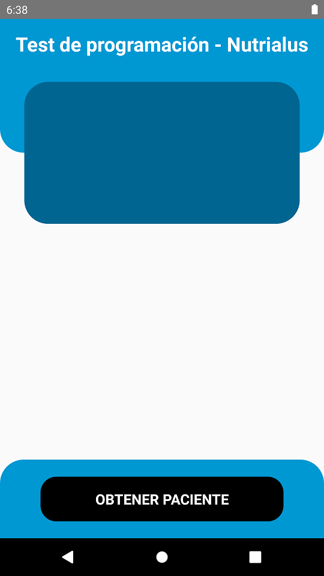
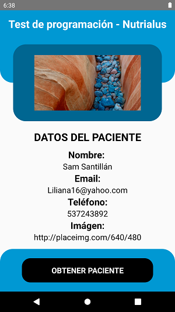
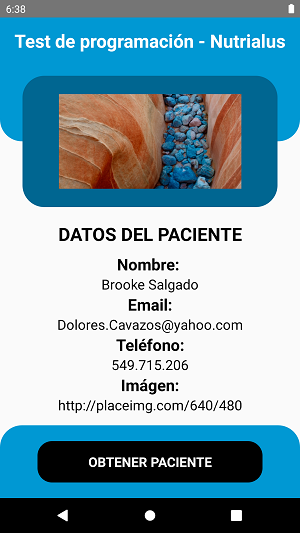

# DESARROLLO Test de programación - Nutrialus

## Nombre: Guillermo Echagüe

## Desarrollo Ejecución Proyecto

Se debe agregar el archivo .../src/utils/constants.js y el siguiente código:

```
export const API_HOST = 'https://0q27loouph.execute-api.us-east-1.amazonaws.com/';
```


En el directorio del proyecto cd ../test ejecutar 

```
npm install

npx react-native run-android
```

Se debe tener instalado Android Studio para poder utilizar el simulador.

## Resultado de la aplicación

### Página de Inicio APP




### Página de Resultados de Petición en APP

 


